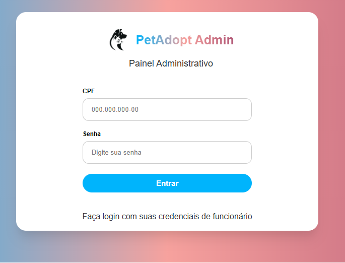
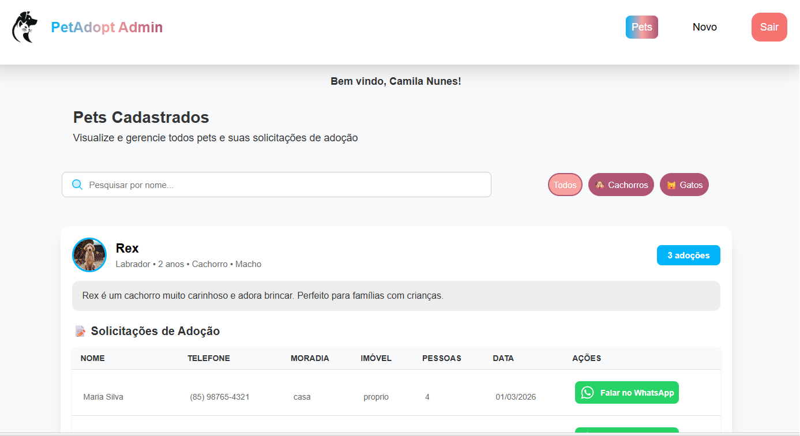
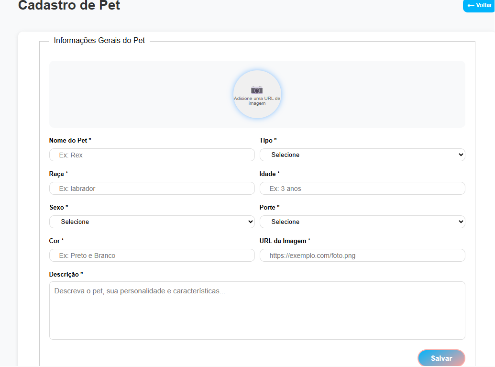

# 🐾 Admin Pets - Frontend

Um painel administrativo (*Admin Dashboard*) moderno e responsivo desenvolvido para o gerenciamento e controle de dados relacionados a pets. Este projeto foi construído utilizando as melhores práticas do ecossistema React e TypeScript, garantindo uma interface fluida, componentizada e integrada a serviços de API.

---

### 📸 Demonstração das Telas

<p align="center">
  
  
  
</p>

---

### 🚀 Tecnologias Utilizadas

O projeto foi desenvolvido utilizando as seguintes ferramentas e bibliotecas:

- **[React](https://react.dev/)** — Biblioteca principal para construção da interface baseada em componentes através de JSX (`className`).
- **[Vite](https://vitejs.dev/)** — Ferramenta de build ultra-rápida para o ambiente de desenvolvimento.
- **[TypeScript](https://www.typescriptlang.org/)** — Adição de tipagem estática para maior segurança e escalabilidade do código.
- **[CSS3](https://developer.mozilla.org/pt-BR/docs/Web/CSS)** — Estilização customizada e estruturação de layout nativa de forma responsiva.

---

### 🔗 Integração com a API

Esta aplicação foi desenvolvida para consumir dados dinamicamente de uma API REST de gerenciamento de pets. 
* Atualmente, o frontend está configurado para se conectar a um servidor local rodando em: `http://localhost:3000`.
* A interface realiza requisições para listar, cadastrar e gerenciar as informações dos pets em tempo real.

---

### 🛠️ Funcionalidades Principais

- **Painel Administrativo:** Visualização organizada de dados e métricas do sistema.
- **Consumo de API Dinâmico:** Estrutura preparada para integração completa de dados (CRUD).
- **Interface Responsiva:** Desenvolvida para se adaptar a diferentes tamanhos de tela (Desktops, Tablets e Smartphones).
- **Componentização Avançada:** Código limpo e reaproveitável estruturado com React, facilitando a manutenção e a aplicação dos estilos.

---

### 📦 Como Executar o Projeto Localmente

Para rodar este projeto na sua máquina, você precisará ter o **Git** e o **Node.js** instalados.

1. **Clone o repositório:**
```bash
git clone [https://github.com/Anderson-Pires-Fernandes/frontend_admin_pets.git](https://github.com/Anderson-Pires-Fernandes/frontend_admin_pets.git)
```

2. **Acesse a pasta do projeto:**
```bash
 cd frontend_admin_pets
```
3. **Instale as dependências:**
```bash
 npm install
```
4. **Inicie o servidor de desenvolvimento:**
```bash
 npm run dev
```
